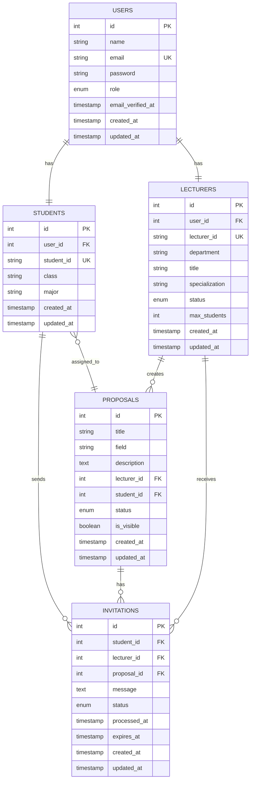

# MÔ HÌNH THỰC THỂ ER - HỆ THỐNG QUẢN LÝ ĐĂNG KÝ NGHIÊN CỨU KHOA HỌC

## Sơ đồ ER

## Chú thích

### Ký hiệu sử dụng:
- **PK**: Primary Key (Khóa chính)
- **FK**: Foreign Key (Khóa ngoại)
- **UK**: Unique Key (Khóa duy nhất)
- **||--||**: Mối quan hệ 1-1
- **||--o{**: Mối quan hệ 1-N
- **}o--||**: Mối quan hệ N-1 (tùy chọn)

### Mô tả các thực thể:

1. **USERS**: Bảng người dùng chính
   - Quản lý thông tin đăng nhập và vai trò
   - Vai trò: admin, lecturer, student

2. **STUDENTS**: Thông tin sinh viên
   - Liên kết 1-1 với USERS
   - Chứa thông tin học tập: lớp, chuyên ngành

3. **LECTURERS**: Thông tin giảng viên
   - Liên kết 1-1 với USERS
   - Chứa thông tin chuyên môn và giới hạn hướng dẫn

4. **PROPOSALS**: Đề tài nghiên cứu
   - Thuộc về một giảng viên (1-N)
   - Có thể được gán cho một sinh viên (N-1, tùy chọn)

5. **INVITATIONS**: Lời mời hướng dẫn
   - Kết nối sinh viên với giảng viên
   - Có thể liên quan đến một đề tài cụ thể

### Mối quan hệ chính:

- **USERS ↔ STUDENTS/LECTURERS**: Mỗi tài khoản thuộc về một sinh viên hoặc giảng viên
- **LECTURERS → PROPOSALS**: Giảng viên tạo nhiều đề tài
- **STUDENTS → INVITATIONS**: Sinh viên gửi nhiều lời mời
- **LECTURERS → INVITATIONS**: Giảng viên nhận nhiều lời mời
- **PROPOSALS → INVITATIONS**: Đề tài có thể có nhiều lời mời
- **STUDENTS → PROPOSALS**: Sinh viên có thể được gán vào đề tài 